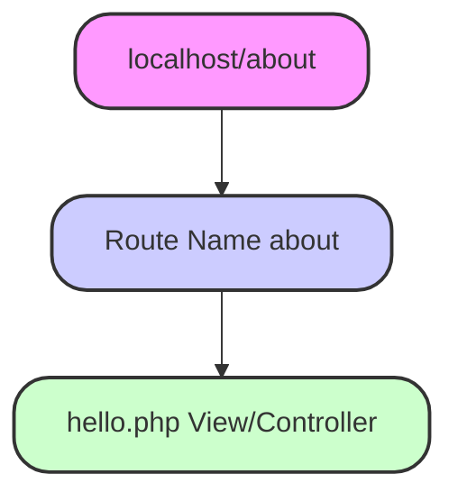

<p align="center"><a href="https://laravel.com" target="_blank"></a></p>

<p align="center">
<a href="https://github.com/laravel/framework/actions"></a>
<a href="https://packagist.org/packages/laravel/framework"></a>
<a href="https://packagist.org/packages/laravel/framework"></a>
<a href="https://packagist.org/packages/laravel/framework"></a>
</p>

## What is Laravel and Why Laravel?

Laravel is a free, open-source PHP web framework, created by Taylor Otwell, intended for the development of web applications following the model–view–controller (MVC) architectural pattern. Laravel is a PHP framework that provides a robust set of tools for building web applications. It is known for its simplicity, flexibility, and scalability.

---

## What is a Framework?

A framework is a pre-built set of tools and libraries that can be used to build web applications. It provides a structure and a set of pre-built functions that can be used to build web applications.

---

## What is MVC?

**MVC** stands for Model-View-Controller. It is a software architectural pattern that separates an application into three interconnected components:

-   **Model**: Represents the data.
-   **View**: Represents the user interface.
-   **Controller**: Handles the business logic.

---

## Laravel Use

Laravel is used for building web applications, APIs, and microservices. It is a popular choice among developers due to its ease of use, flexibility, and scalability.

---

## Laravel Features

Some key features of Laravel include:

1. **MVC Architecture**: Laravel follows the Model-View-Controller (MVC) architecture, which separates the application logic into three interconnected components.
2. **Routing**: Laravel provides a powerful routing system that allows you to define routes for your application.
3. **Eloquent ORM**: Laravel comes with a powerful Object-Relational Mapping (ORM) system called Eloquent, which provides a simple and elegant way to interact with your database.
4. **Blade Templating Engine**: Laravel provides a powerful templating engine called Blade, which allows you to write clean, readable, and maintainable templates for your application.
5. **Authentication and Authorization**: Laravel provides a robust authentication and authorization system that allows you to manage user sessions, authentication, and authorization.
6. **Caching**: Laravel provides a powerful caching system that allows you to cache your application's data and improve performance.
7. **Queueing**: Laravel provides a powerful queueing system that allows you to run background jobs asynchronously.

---

## Laravel Installation

### Laravel Xampp Mini Requirements:

1. **PHP 7.4 or higher**: Laravel requires PHP 7.4 or higher.
2. **Composer**: Composer is a dependency manager for PHP that allows you to manage dependencies for your project.
3. **Node.js**: Node.js is a JavaScript runtime environment that allows you to run JavaScript code on the server-side.
4. **Git**: Git is a version control system that allows you to manage different versions of your code.

### Steps to Install Laravel:

1. **Install Composer**:

    - First, you need to install Composer on your system. You can download it from the official Composer website.

    **Steps to set the environment for Composer:**

    - **Set the environment variable**.
    - **Copy this path according to your computer**: `C:\Users\user\AppData\Roaming\Composer\vendor\bin`
    - **Add the path to the system's PATH environment variable**.
    - **Verify Composer** installation: Run the command `composer` in the terminal.

2. **Create a new project**:

    - Once Composer is installed, run the following command:
        ```bash
        composer create-project --prefer-dist laravel/laravel project-name
        ```

3. **Change directory**:

    - Navigate to the project directory:
        ```bash
        cd project-name
        ```

4. **Install dependencies**:

    - Run the following command to install Laravel's dependencies:
        ```bash
        composer install
        ```

5. **Create a database**:

    - Create a new database for your application using your preferred database management system.

6. **Configure database**:

    - Configure the database connection in the `.env` file.

7. **Run migrations**:

    - Run database migrations:
        ```bash
        php artisan migrate
        ```

8. **Start the server**:

    - Start the Laravel development server:
        ```bash
        php artisan serve
        ```

9. **Access the application**:
    - You can now access your application in your browser at: `http://localhost:8000`.

---

### Global Installation of Laravel:

1. **Install Composer**:

    - Install Composer if you haven't already.

2. **Create a new project**:
    - Once Composer is installed, run the following command to globally install Laravel:
        ```bash
        composer global require laravel/installer
        ```
    - Then, create a new Laravel project:
        ```bash
        laravel new example-app
        ```

---

## What is Composer?

**Composer** is a dependency manager for PHP that allows you to manage libraries and packages required for your project. It helps install, update, and remove libraries and manages your PHP project’s dependencies.

---

# Essential VS Code Extensions for PHP & Laravel Development

-   **PHP IntelliSense** by Damjan Cvetko 
-   **PHP Namespace Resolver** by Mehedi Hassan 
-   **Laravel Extra Intellisense** by Amir 
-   **Laravel Blade** by Christian Howe 
-   **Laravel Blade Snippets** by Winnie Lin 
-   **Laravel Go To View** by Codingyu 

## Laravel Project Structure

A Laravel project typically consists of the following directories and files:

1. **app**: Contains application code (models, controllers, services).
2. **bootstrap**: Contains bootstrap files like `autoload.php`.
3. **config**: Contains configuration files like `database.php`.
4. **database**: Contains database migrations and seeders.
5. **public**: Contains public assets like CSS, JS, and images.
6. **resources**: Contains views, layouts, and language files.
7. **routes**: Contains route files, e.g., `web.php`.
8. **storage**: Contains logs, cache, and other storage files.
9. **tests**: Contains unit and integration test files.
10. **vendor**: Contains Composer dependencies.

---

### Folder Breakdown:

-   **Model Folder**: Handles database/SQL queries.
    -   Path: `app > http > Model`
-   **Controller Folder**: Handles business logic.
    -   Path: `app > http > Controller`
-   **View Folder**: Contains HTML files for the front-end.
    -   Path: `resources > View`
-   **Route Folder**: Defines routes (URL) for the application.
-   **Public Folder**: Publicly accessible assets (CSS, JS, images, etc.).
-   **Storage Folder**: Storage files (logs, cache, etc.).
-   **Tests Folder**: Contains test files (unit tests, integration tests).
-   **Vendor Folder**: Contains Composer dependencies.

---

## Laravel Routing

-   **WebPage URL**: Defines routes for your webpages.
-   **APIs URL**: Defines routes for API endpoints.



# 🚀 Laravel Routing Example

In this guide, we'll break down how routing works in Laravel and provide a well-structured example.

## 📂 Folder Structure

Your route definition is typically found in the `routes/web.php` file. Here's the folder structure:

## 🧑‍💻 Code Example

### 📍 Defining Routes in `web.php`

In the `routes/web.php` file, you define the routes for your application. For instance, here's an example where we define a simple route for the `/about` URL.

```php
// routes/web.php

Route::get('/about', function () {
    return view('hello');
});

```

## 🛠️ Explanation of the Code

-   **`Route::get('/about', ...)`**: This defines a **GET** route for the `/about` URL.
-   **`function() {...}`**: The **closure** that runs when the route is accessed.
-   **`return view('hello')`**: This returns a view named `hello` when the route is triggered.

# Laravel Route Example: About Page

This guide demonstrates how to create a simple view file in Laravel and display it in the browser.

## Step : Create the Route about View File

In Laravel, Blade is the templating engine used to create views. The first step is to create a Blade view file that will render the content you want to display in the browser.

1. **Create a Blade file** in the `resources/views` directory. For this example, we'll create a file called `hello.blade.php`.

2. **Add content** to the file. For our "About" page, we will use the following simple HTML:

```html
<!-- resources/views/hello.blade.php -->
<h1>This is my About Page</h1>

Route::get('/about', function () { return view('hello'); });
```

```
when u browser this 127.0.0.1:8080/about
u will see this is my about page page view

```

# Directly Returning HTML from a Route in Laravel

This guide demonstrates how to define a route in Laravel that directly returns raw HTML content.

## Step 1: Define a Route with Raw HTML Content

In Laravel, you can define a route that directly returns raw HTML by using the `response()->make()` method.

### Example Code:

```php
// routes/web.php

use Illuminate\Support\Facades\Route;

Route::get('/post', function () {
    return response()->make('<h1>This is my route page</h1>');
    // return "<h1>This is my route";

});
```

# Another Way to Define a Route in Laravel

Laravel provides a simple method `Route::view()` to directly return a view without needing to define a closure. This method is useful for returning a view in response to a specific URL.

You can use `Route::view()` to define a route that returns a specific view. In this example, we will define a route that returns the `post` view.

### Syntax of `Route::view()`

The basic syntax of `Route::view()` is as follows:

```php
Route::view('uri', 'view');

    'uri' is the URL path that the route should respond to (e.g., /post).
    'view' is the name of the Blade view that should be returned (e.g., 'post').
```

# How Anchor Tags Work in Laravel Routes

In Laravel, you can use anchor tags (`<a>`) in Blade views to navigate between different routes defined in your application. The `href` attribute in the anchor tag points to the route URL, and when clicked, it will take the user to the corresponding page.

## Example Code: Using Anchor Tags in Blade Views

### Step 1: Define the Route in `routes/web.php`

You define the route `/post` in the `routes/web.php` file, which returns a view named `post` when the route is accessed.

```php

// routes/web.php

use Illuminate\Support\Facades\Route;

Route::get('/', function () {
    return view('welcome');
});

Route::get('/post', function () {
    return view('post');
});

```

## Step 2: Create the Blade View `welcome.blade.php`

In your `welcome.blade.php` view (or any other Blade file), you can use an anchor tag to link to the `/post` route.

### Example Code:

```html
<!-- resources/views/welcome.blade.php -->

<h1>This is the home page</h1>
<a href="/post">Post Page</a>
```
